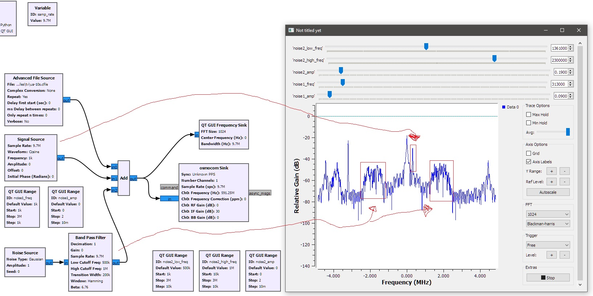

# Generating Video

Install sox + ImageMagic + ffmpeg and run:

    gen-video.bash

# Simulate interference with GNU Radio

`tv_from_file_with_noise.grc` has 2 sources of interference:

* sinusoid with ajustable freq
* noice in the freq range

# HackTV projects

https://github.com/steeviebops/hacktv-gui/blob/main/src/com/steeviebops/hacktvgui/GUI.java
:   Java GUI frontend for CLI tool.
https://github.com/steeviebops/hacktv-gui/blob/main/src/com/steeviebops/resources/fsphil/Modes.ini
:   Mapping of freq to TV channel number.

# Building / packaging HackTV for Windows Mingw64 / pacman.

See [Mingw64 + pacman README](hacktv-mingw64-pacman/README.md).

# IQ signal analyzers

## Inspectrum

In official Debian. Radioconda's build fails for me, use one from WSL 2.

inspectrum supports the following file types:

    *.sigmf-meta, *.sigmf-data - SigMF recordings
    *.cf32, *.fc32, *.cfile - Complex 32-bit floating point samples (GNU Radio, osmocom_fft)
    *.cf64, *.fc64 - Complex 64-bit floating point samples
    *.cs32, *.sc32, *.c32 - Complex 32-bit signed integer samples (SDRAngel)
    *.cs16, *.sc16, *.c16 - Complex 16-bit signed integer samples (BladeRF)
    *.cs8, *.sc8, *.c8 - Complex 8-bit signed integer samples (HackRF)
    *.cu8, *.uc8 - Complex 8-bit unsigned integer samples (RTL-SDR)
    *.f32 - Real 32-bit floating point samples
    *.f64 - Real 64-bit floating point samples (MATLAB)
    *.s16 - Real 16-bit signed integer samples
    *.s8 - Real 8-bit signed integer samples
    *.u8 - Real 8-bit unsigned integer samples

https://github.com/miek/inspectrum
:   Gihub page.

## Universal Radio Hacker (URH)

https://github.com/jopohl/urh
:   Gihub page.

https://github.com/jopohl/urh/releases
:   Windows build download.

## SigDigger

Has no official Windows build, they state it is problematic.

https://batchdrake.github.io/SigDigger/
:   Home page

https://github.com/BatchDrake/SigDigger
:   Gihub page.

# Free DSL learning resources

https://greatscottgadgets.com/sdr/
:   Software Defined Radio with HackRF.

https://pysdr.org/
:   PySDR: A Guide to SDR and DSP using Python.

https://www.youtube.com/playlist?list=PLBfTSoOqoRnOTBTLahXBlxaDUNWdZ3FdS
:   ECE4305 Software Defined Radio Systems and Analysis.

https://www.analog.com/en/resources/technical-books/software-defined-radio-for-engineers.html
  Software-Defined Radio for Engineers, 2018
https://github.com/sdrforengineers/
  Supplementary info.
https://www.afidc.ethz.ch/A_Foundation_in_Digital_Communication/Getting_the_Book.html
  Amos Lapidoth 0 A Foundation In Digital Communication, 2017
https://jackschaedler.github.io/circles-sines-signals/
  A Compact Primer On Digital Signal Processing.
https://pysdr.org/content/intro.html
  PySDR: A Guide to SDR and DSP using Python.
https://www.dspguide.com/
  The Scientist and Engineer's Guide to Digital Signal Processing
https://www.analog.com/en/resources/technical-books/scientist_engineers_guide.html
  The Scientist & Engineer's Guide to Digital Signal Processing, 1999

https://wiki.gnuradio.org/index.php?title=SuggestedReading
:   Suggested Reading.

https://www.youtube.com/playlist?list=PLywxmTaHNUNyKmgF70q8q3QHYIw_LFbrX
:   Learn SDR with Prof Jason.

https://www.youtube.com/@w2aew
:   #170, #171 are about IQ coding

https://www.youtube.com/watch?v=h_7d-m1ehoY
:   #170: Basics of IQ Signals and IQ modulation & demodulation - A tutorial

https://www.youtube.com/watch?v=5GGD99Qi1PA
:   #171: IQ Signals Part II: AM and FM phasor diagrams, SSB phasing method

# TV signal structure

https://github.com/fsphil/hacktv
:   Analogue TV transmitter for the HackRF.
https://github.com/captainjack64/hacktv
:   Fork with some improvements.

https://github.com/argilo/sdr-examples/blob/master/ntsc/ntsc-encode.py
:   Analogue NTSC encoding.

hacktv.exe -f 591250000 -g 30 -m pal-k -s 9700000 -r ua-10s.mp4
hacktv.exe -m pal-k -s 7000000 ua-10s.mp4 -t float -o file:ua-10s-7mhz.cf32

Only starting with sampling rate 14Msps the signal structure is OK:

    wsl hacktv -m pal-k -s 14000000 ua-10s.mp4 -t float -o file:ua-10s-l-14mhz.cf32

Lower sample rates generates incorrect placed color & audio baseband locations in spectrum:

    for i in 1 2 3 4 5 6 7 8 9; do \
      hacktv.exe -m pal-k -s ${i}000000 ua-1s.mp4 -t float -o file:ua-1s-${i}mhz.cf32; \
    done

    for i in 1 2 3 4 5 6 7 8 9; do \
      hacktv -m pal-k -s ${i}000000 ua-1s.mp4 -t float -o file:ua-1s-l-${i}mhz.cf32; \
    done

Offifial man page stages:

> 16MHz works well with PAL modes, and 13.5MHz for NTSC modes.

`pal-k` spec:

    pal-k          = PAL colour, 25 fps, 625 lines, AM (complex), 6.5 MHz FM audio

Sending test signal (`-r` repeat, `-s` sample rate, `-f` carrier frequency, `-g` gain dB 0-47):

    hacktv.exe -f 591250000 -g 30 -m pal-k -s 16000000 -r test

    hacktv.exe -f 591250000 -g 30 -m pal-k -s 16150000 --filter -r test --nocolour --noaudio

591.25 + 6.5 = 597.75
591.25 + 4.4336 = 595.6836
591.25 - 4.4336 = 586.8164

|TV mode|HackTv mode|
|:---:|:---:|
|`L`|`l`|
|`BG`|`b` or `g`|
|`DK`|`d` or `k` or `pal-d` or `pal-k`|
|`I`|`i` or `secam-i` or `ntsc-i`|

Sending test signal to HackRF:

    wsl hacktv -f 591260000 -g 30 -s 9718750 -r test -m l

Generate a file and transfer it repeadedly via HackRF:

    hacktv -s 9800000 -m ntsc-i -t uint8 ua-10s.mp4 -o file:ua-9msps.cu8
    hackrf_transfer.exe -f 535250000 -x 30 -s 9800000 -R -t C:\Users\user\work\achilles\tv\ua-9msps.cu8

Check that external clock (TCXO) is in use:

    hackrf_clock -i
    CLKIN status: clock signal detected

# DSP

2 most popular window functions are Hann and Hamming:

https://en.wikipedia.org/wiki/Window_function
https://en.wikipedia.org/wiki/Convolution
https://en.wikipedia.org/wiki/Linear_time-invariant_system

# Stereo FM audio encoding

https://transmitters.tripod.com/stereo.htm

https://web.archive.org/web/20111223010330/http://cliftonlaboratories.com/fm_%26_tv_subcarriers.htm
:   FM Broadcast and TV Broadcast Aural Subcarriers

https://github.com/f4exb/ngsoftfm
:   Rewrite of SoftFM

https://dsp.stackexchange.com/questions/18515/how-to-recover-complex-values-downconvert-from-fm-modulation-composite-signal

# Spectrum DB

https://www.sigidwiki.com/wiki/Category:Analogue
https://www.sigidwiki.com/wiki/PAL_Broadcast
https://www.sigidwiki.com/wiki/NTSC_Broadcast

https://en.wikipedia.org/wiki/Carson_bandwidth_rule
  Estimation of FM modulated bandwidth.
  CBR = 2*(Δf+fm) (peak deviation + highest frequency)

PAL FM:
	.fm_deviation   = 16e6, /* 16 MHz/V */
	.colour_carrier = { 17734475, 4 }, /* 4433618.75 Hz */
	.fm_mono_carrier   = 6500000, /* Hz */
	.fm_mono_deviation = 85000, /* +/- Hz */

NTSC FM:
	.fm_deviation   = 17.0e6, /* 17.0 MHz/V */
	.colour_carrier = { 39375000, 11 }, /* 3579545.4545... Hz */
	.fm_mono_carrier   = 6500000, /* Hz */
	.fm_mono_deviation = 85000, /* +/- Hz */

Carlson bandwidth rule:
2*(16+8) = 48MHz for PAL
2*(17+6) = 46MHz for NTSC

# VTX (Video Transmitter) for FPV Drones

FPV goggles

https://oscarliang.com/fpv-channels/
:  5.8GHz frequency spectrum for racing.

https://www.getfpv.com/learn/wp-content/uploads/2019/09/Frequency-Reference-Chart-2020-12-23.pdf
:  5.8GHz frequency spectrum for racing.

